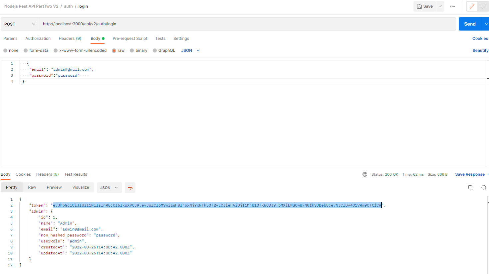
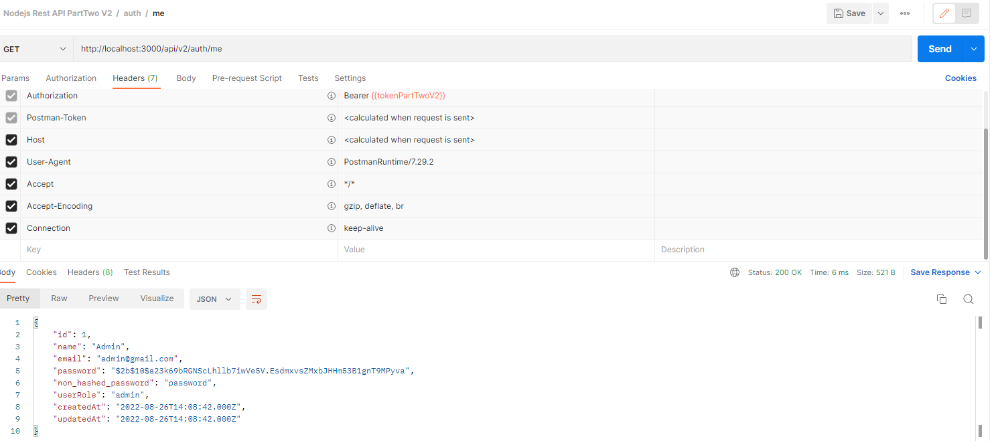
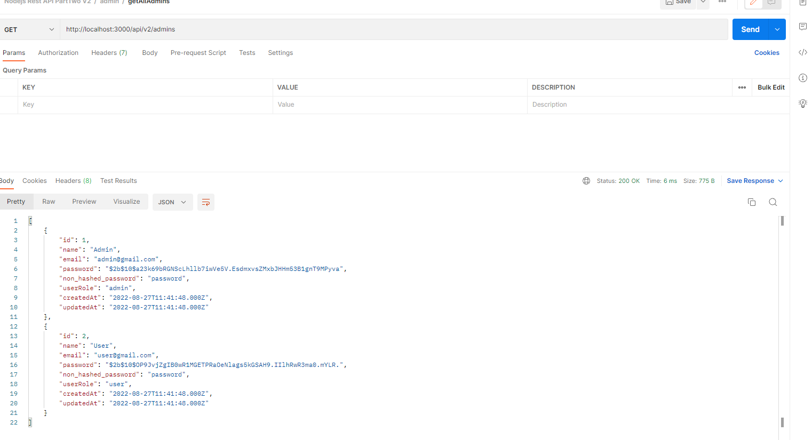
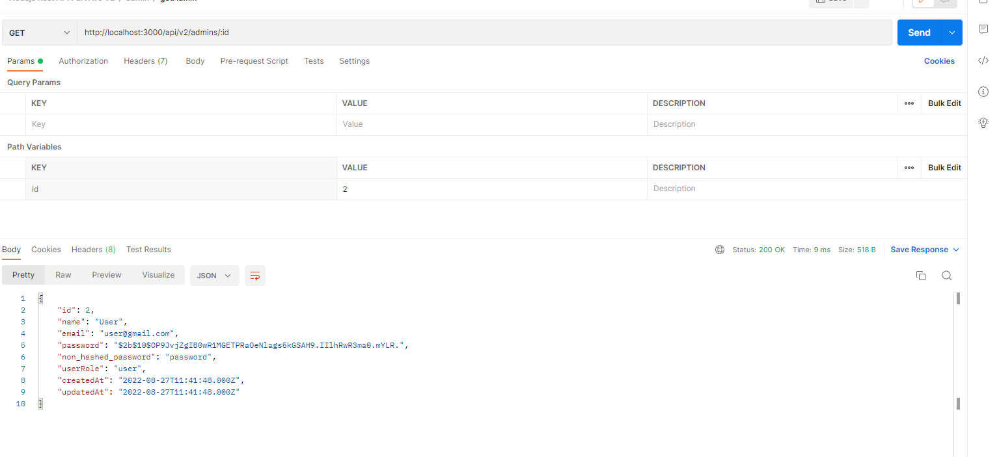
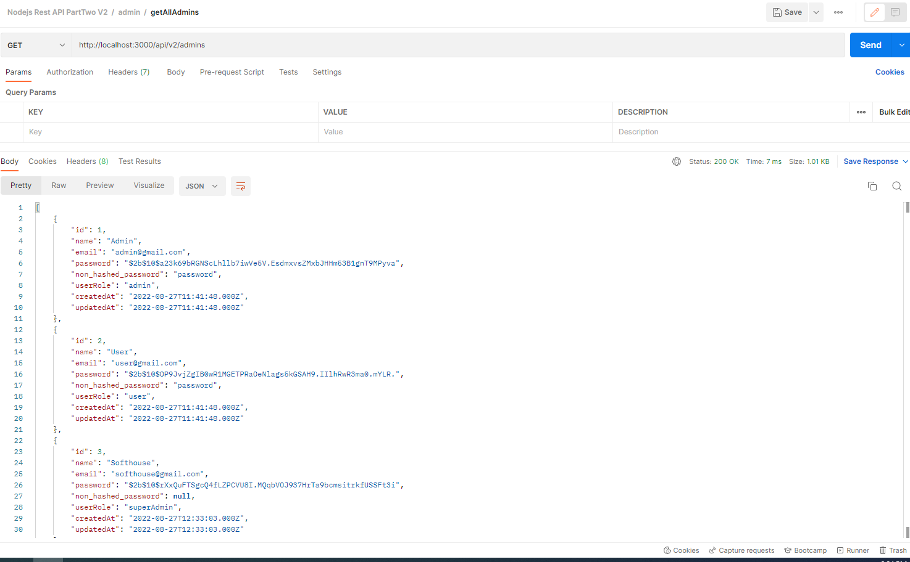
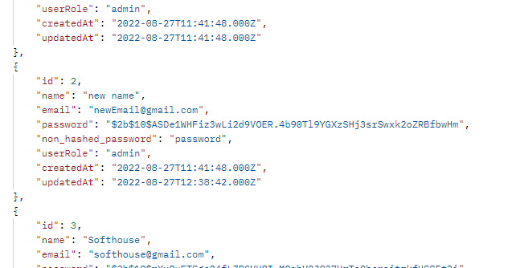
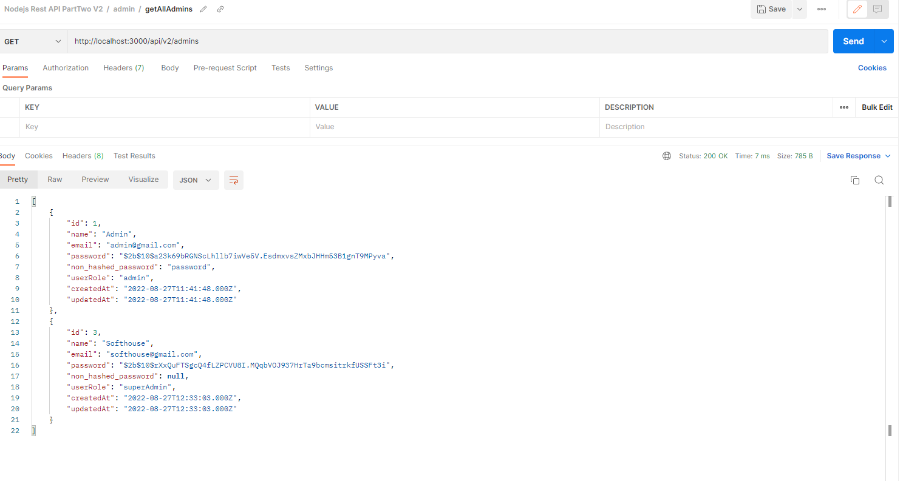

# A-Secure-Node-js-REST-API-with-mysql

## This Nodejs REST API part two is intended to be secure and user-friendly, and it makes use of best API practices

***

The APIs could be improve over time to be more secure.

### Check out [Nodejs-REST-API-part-one uses JSON files for storage](https://github.com/rqkohistani/Build-a-Secure-Nodejs-REST-API-part-one)

***

***

## Steps to run Node JS REST API part two

***

## 1 Run database queries

### Prepare the database

Copy and past DBqueries.sql file from the root of the project.
Run the DBqueries.sql file to create the database and tables.
Check the database and tables are created and data is inserted.
***

## 2 Export the APIs collection to the Postman

1. Download the Nodejs Rest API PartTwo V2.postman_collection file on the current repo
2. Launch Postman
3. Select the import icon.
4. Upload the Nodejs Rest API PartTwo V2.postman_collection file
5. Go to auth/login and enter the username and password

***

## Clone the repo

1. npm install
2. npm start

## 3 Login

### Login with username and password

1. auth/login
2. username: admin
3. password: password
4. Expect the response to be 200 and the token to be returned. The token is used in the next steps.
5. Available admin and users: Use one of the following:
6. Superadmin and admin they have access to all the APIs. This is how **I want to use the API**. However, reqular users can only access the APIs they have access to. Perhaps more users like guest users can be added with different permissions and some APIs can be restricted and so on.

***

* superadmin

          {
          "email": "softhouse@gmail.com",
          "password": "password"    
           } 

***  

* admin

          {
          "email": "admin@gmail.com",
          "password": "password"    
           } 

***

* user

          {
          "email": "admin@gmail.com",
          "password": "password"    
           } 

***

7. Login
    * 
    * 
8. Save the token
    * Click on the Nodejs REST API part two V2 collection
    * Go to Variables
    * Paste in the token
    * tokenPartTwoV2
    * Make sure one of tokenPartTwoV2 is selected.
      * Multiple of tokenPartTwoV2 can be used to login with different authorizations but one must be selected at the time.
    * click on the **Save** button
    * 

***

1. The  **Get ...auth/me** route will return the user who is logged in.
    * Click on the me route
    * Click on the Send button
    * if successful you should see the following
    * else you will see a "message": "Invalid token"
    * 

***

### Get all admins and user

***

### Get an admin by id

### Create an admin or user

1. Click on the admin/admin post route
2. Fill new Admin or user credentials in the Body
3. Validation would take care of if unnecessary fields are added.
4. Click Send
5. 
6. 

***
       {
            "name":"Softhouse",
            "email": "softhouse@gmail.com",
            "password": "password",
            "userRole": "superAdmin"
        }

***

### Update an admin or user

1. Click on the admin/admin update route
2. Edit Admin or user credentials in the Body
3. Params
    * id: the id of the admin or user
4. Validation would take care of if unnecessary fields are added.
5. Click Send
6. 
7. 
8. 
9. 

***

    {
        "name":"new name",
        "email": "newEmail@gmail.com",
        "password": "New password",
        "userRole":"admin"
    }

### Delete an admin or user

1. Click on the admin/admin delete route
2. Params
    * id: the id of the admin or user
3. Click Send
4. 
5. 

***

## Similar techniques are used to implement the rest APIs

You can check them out. You got the idea

***

## Cutomers

### Get all customers

1. Click on the customer/customer getAllCustomer route
2. Click Send

### Get a customer by id

1. Click on the customer/customer getCustomer route
2. Params
    * id: the id of the customer
3. Click Send

### Create a new customer

1. Click on the customer/customer create post route
2. Fill new customer credentials in the Body
3. Validation would take care of if unnecessary fields are added.
4. Click Send

***

    {
        "name":"New customer",
        "username": "newUsername",
        "email": "newCustomer@gmail.com",
        "password": "password"
    }

***

### Update a customer

1. Click on the customer/customer update route
2. Edit customer credentials in the Body
3. Params
    * id: the id of the customer
4. Validation would take care of if unnecessary fields are added.
5. Click Send

***
    {
    "name":"New update name",
    "username": "newUsername",
    "email": "newEmail@gmail.com",
    "password": "password"
    }
***

### Delete a customer

1. Click on the customer/customer delete route
2. Params
    * id: the id of the customer
3. Click Send

***

## Posts

### Get post by post id

1. Click on the post/post get Post by post id route
2. Params
    * id: the id of the post
3. Click Send

***

### Get all customer posts

1. Click on the post/post get all customer posts route
2. Click Send

***

### Create a new post

1. Click on the post/post create post by customer id route
1. Fill new post credentials in the Body
1. Validation would take care of if unnecessary fields are added.
1. Click Send

***

    {
        "customerId": 12,
        "title": "title one",
        "body": "body one text",
        "extra": "data will be thrown away"        
    }

***

### Update a post by post id and customer id in the body

1. Click on the post/post update post by post id and customer id in the body route
1. Fill new post credentials in the Body
1. Params
    * id: the id of the post

1. Validation would take care of if unnecessary fields are added.
1. Click Send

***

    {
    "customerId": 12,
    "title": "title one",
    "body": "body one text",
    "extra": "data will be thrown away"
    }
    "customerId": 17,
    "title": "title one",
    "body": "body one text",
    "published":1
    }
    {
    "customerId": 17,
    "title": "title one",
    "published":1
    }
    {
    "customerId": 17,
    "published":1
    }

***

### Delete a post by post id and customer id in the body

1. Click on the post/post delete post by post id and customer id in the body route
1. Params
    * id: the id of the post
1. Validation would take care of if unnecessary fields are added.
1. Click Send

***

### THANK YOU FOR READING THIS DOCUMENTATION. I HOPE YOU ENJOYED IT. PLEASE FEEL FREE TO CONTACT ME IF YOU HAVE ANY QUESTIONS OR SUGGESTIONS. THANK YOU

## [linkedIn](https://www.linkedin.com/in/rashed-qazizada-1b64b68a/)
